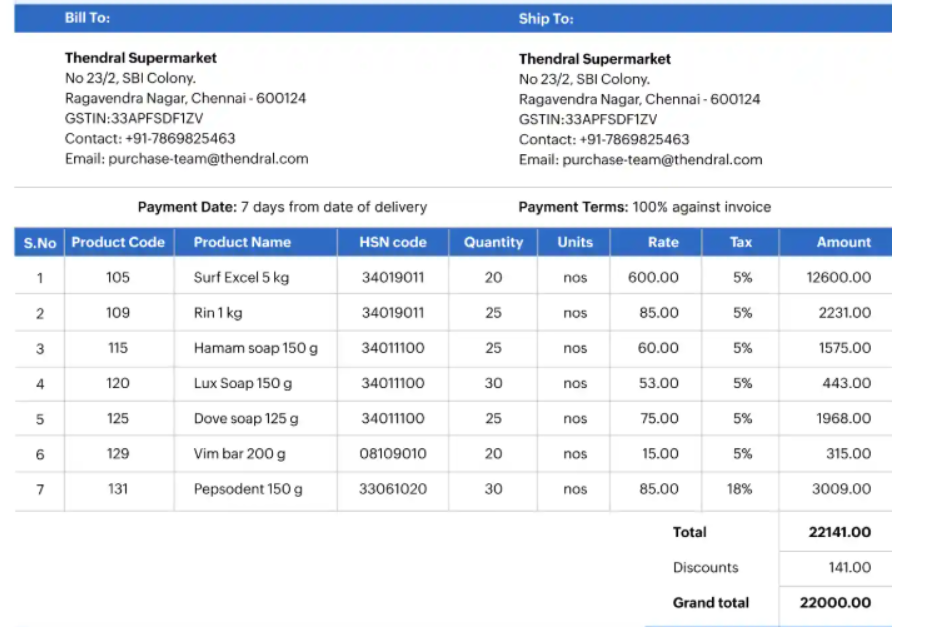

#  Sales Invoice Program (Java)

##  Task
Design and implement a **Java program** that generates a fully formatted sales invoice based on the provided sample invoice image.

Your program must resemble the sample invoice as closely as possible using **only Java basics**.

---

##  Requirements
- **Variables**
- **Scanner** for input
- **Arithmetic operators**
- **Output formatting** using `System.out.println()`
- ❌ No arrays
- ❌ No loops
- ❌ No decision-making statements
- ❌ No functions/methods beyond `main`

---

##  Input
Your program must capture the following from the user:
- **Bill To Information**
- **Ship To Information**
- **Product Information**

---

##  Computation
- Perform all necessary calculations (amounts, totals, discount, grand total).
- Use the given discount value: **0.6368%**

---

##  Output
- Display a **fully formatted invoice**:
  - Proper spacing and alignment
  - Dashed gridlines
  - Table structure
  - Section headers (Bill To, Ship To, Payment Terms, Product Table, Totals)

---

##  Constraints
- Program must be implemented in a **single `main` method**.
- No advanced Java features (arrays, loops, conditionals, methods).
- Output must closely match the sample invoice provided.

---
## Expected Outcome

---
